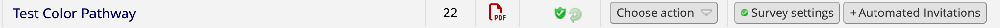

# NALMS (Not Another LMS)
NALMS is the REDCap project intended to deliver the DART learning pathways to learners.

The purpose of this repository is to create the files needed for that project, including:
- zip files of REDCap Forms
- ASI (Automated Survey Invitations)
- scripts for the REDCap API to automate tasks in REDCap whenever possible

Ultimately a user should be able to create a pathway using section headings and module names, and then generate all files needed to create that pathway on REDCap.

## Setup for admin tasks

You'll need REDCap API tokens for the following projects:

- DART Pipeline (pid=56668)
- NALMS (pid=57556)

Your API tokens should be saved as environment variables. 
You can save your tokens as environment variables in R by [editing .Renviron](https://cran.r-project.org/web/packages/httr/vignettes/secrets.html#environment-variables) (for more detailed instructions, see our [REDCap API module](https://liascript.github.io/course/?https://raw.githubusercontent.com/arcus/education_modules/main/using_redcap_api/using_redcap_api.md#20)).
You'll only need to do this once.

**Be sure to save the NALMS token as `NALMS_57556` and the Pipeline token as `Pipeline_56668`.**

Note: To run the CLI commands here, make sure you're in the main NALMS directory. 

Note that if you want to send notifications and ASIs from a shared email (e.g. the dart email), you can [add that email to your redcap account](https://www.research.chop.edu/announcements/adding-another-email-address-to-your-redcap-profile) to be able to use it. This needs to be done for at least one person on the project.  

### Updating `module_times.txt`

If new modules have been created or the times of modules have been changed since pathways were last created (i.e. at the start of a new wave) you will need to update the `module_times.txt` file.

The `index_all_modules.sh` script should be run from the top level directory of the `education_modules` repository and the times output can be copied into the `module_times.txt` file. This is cludgy but shouldn't have to be done more than once per wave. As the metadata gets updated across modules this process will need to be updated as well. (`estimated_time` is becoming `estimated_time_in_minutes`).

## Creating a pathway

The point of this repository is to make creating a new DART Pathway as easy as possible. But there are still a few steps involved.

### Organize the modules that will be in the pathway

Within the `pathways` directory recreate the following structure of nested folders with the name of the new pathway replacing `test_color`

```
./
└── pathways
    └── test_color
        └── sections
            ├── 1_First_Section.md
            ├── 2_Second_Section.md
            └── 3_Third_Section.md
```

The section files contain the name of the section on the first line, followed by the keys for the modules it contains:

```
Section Name For Display
reproducibility
citizen_science
using_redcap_api
```

#### Finding a module's key

A module's key is the name of both the markdown file and the folder containing that module in https://github.com/arcus/education_modules. 

The key may or may not match the title of the module, for example `reproducibility` is a shortened version of the module's full title, `citizen_science` is in fact the module's name, but "Intro to Version Control" has key `git_intro`.

### Create the files to upload to REDCap

To create the files for the `test_color` pathway, run this bash script from the main directory of this repository:

```
bash scripts/create_REDCap_files.sh test_color
```

This will create the zip file for the instrument that can be uploaded directly to REDCap, as well as the automated survey invitations and the alert for when a user has completed the pathway.

These files will be created in the folder for that pathway (e.g. `test_color`), with the pathway name you used instead of `test_color`.

```
./
└── pathways
    └── test_color
        └── sections
            ├── 1_First_Section.md
            ├── 2_Second_Section.md
            └── 3_Third_Section.md
        └── asi_test_color.csv      (ASI file to upload to REDCap)
        └── alerts_test_color.csv              (alert file to upload to REDCap)
        └── test_color.zip          (instrument zip to upload to REDCap)
```

### Upload instrument zip

In REDCap in the NALMS project (pid=57556), go to Designer, and click the "Upload and Instrument zip file" button.


Upload the zip file you just created.

### Make instrument repeating

In the main NALMS directory, run `make_pathways_repeating.R`. This script isn't specific to your pathway; it will make all pathway forms in the NALMS REDCap project repeating (it's fine to do this redundantly, and it turns out that's the most straightforward way with the REDCap API). You can do this from the command line with the following: 

`Rscript scripts/make_pathways_repeating.R`

### Upload automated survey invitation (ASI)

On the same Designer page in REDCap, click the "Auto invitations options" under "Survey Options"


Select "upload automated survey invitations settings (csv)" and select "Choose and upload csv".
Upload the csv called "asi_test_color.csv" in your pathway's directory.

### Upload alerts

In REDCap, go to Alerts & Notifications.
Click "Upload or download alerts", and then "Upload Alerts (CSV)".


Select "alerts_test_color.csv" in your pathway's directory.
This will upload **15** alerts for your pathway: 14 to nudge participants (weekly, on weeks 3-16 inclusive) who are inactive for at least two weeks, and 1 to congratulate participants who finish their pathways.

### Check that pathway is correctly set up in REDCap

**On the Designer page**: check that your pathway exists, is repeating, and has an active automated survey invitation:



You can click on the pathway name to check that all questions are present. The "enabled as survey" column should have both a green badge and a green circular arrow. The text on the "Automated Invitations" button should be green, indicating the survey is active. Click on that button to check that the text and other settings are correct.

**On the Alerts & Notifications page**: find the alerts for "test_color" pathway (or whichever pathway you are currently checking). There should be **15** total alerts, one called "Completed test_color pathway" and 14 called "Inactive nudge test_color pathway Week #" for Weeks 3-16. 

Make sure there are exactly **15** alerts for your new pathway, and no more (i.e. that you didn't accidentally re-upload existing alerts).

You can click "Edit" to verify that the settings for any given alert are correct, or use the "preview" button to see the alert text.


## Getting data from DART Pipeline

The following fields in NALMS come from DART Pipeline:

- record_id
- first_name
- last_name
- email
- enrolled
- opted_out
- dropped_out
- wave
- pathway

All of these fields are in the **Basic Info** form in NALMS, which is a form we fill out, not a participant-facing survey. 

**NOTE:** When a learner contacts us to update this information in any of these fields (preferred name, email, dropping out, etc.), it is our responsibility to update that in **both** REDCap projects: DART Pipeline (pid=56668) and NALMS (pid=57556). 

### Running data import scripts

There are two different R scripts for importing data into NALMS:

- `import_redcap_pathway_data.R`: To be run once, before the beginning of a new wave
- `sync_data_from_pipeline.R`: To be run periodically (weekly?) while a wave is underway

#### Initial import script

`import_redcap_pathway_data.R` sets up the data in NALMS at the beginning of a new wave. 

It pulls over learner info from Pipeline (fields in the Basic Info form, such as name and email), but it also sets up each learner's initial state for their pathway. 
For each learner, it puts in a status of 0 (not started) for every module in their assigned pathway survey and marks the survey as complete for the first instance. 
It leaves everything on the other surveys blank for that learner. 

All of the pathway surveys are set to allow repeating instances, and to display the last instance's responses as the default for each module status. 
So when a learner opens their pathway survey for the first time, it will show what REDCap thinks the previous instance is ("not started" for every module), which was actually entered by us. 
The first set of genuine learner responses will be recorded by REDCap as instance 2. 

#### Periodic syncing script

In addition to manually updating both NALMS and Pipeline with changes in learner information, we can periodically run the `sync_data_from_pipeline.R` import script to ensure the data in both places is staying synched. 

This script overwrites the fields that should be synced between Pipeline and NALMS with the current Pipeline data --- that means if you update Basic Info in NALMS and forget to add it to Pipeline as well, it will get erased! 
This script doesn't touch pathway survey responses, only the fields in the Basic Info form. 

**Note:** Eventually, it would be preferable to replace this syncing process with the [cross-project piping](https://github.com/vanderbilt-redcap/cross-project-piping-module) external module for REDCap, but it's not working in our tests with redcap_v13.4.12.

## Updating User Contact Info

Learners can update their contact info with us by filling out the [contact info update form](https://redcap.chop.edu/surveys/?s=C8DL97HYP3PDFDWP) (which is in its own RECap project, pid 59698). 
This triggers an email to hartmanr1@chop.edu with the updated fields. 

Then it is **our responsibility** to update both DART Pipeline and NALMS with the new info. 

## Changing admin settings for NALMS

The settings for things like pathway reminder email cadence and program length are saved in `templates/survey_settings.csv`. 
To edit them, change them in the template and then re-create all the pathway files and re-upload to REDCap. 

## Other admin tasks

### Get a user's pathway survey link

At the request of a learner, use their name and/or email address to find their record in NALMS and send that learner a link to their pathway:

**Find their Record ID**

- In the [NALMS project in REDCap, go to Data, Exports, Reports & Stats](https://redcap.chop.edu/redcap_v13.4.12/DataExport/index.php?pid=57556&report_id=ALL). 
- Start entering the user's name or email in the search box at the top to filter the records. Make a note of the user's Record ID. 

**Get their survey link**

- Click on [Survey Distribution Tools, and then Survey Invitation Log](https://redcap.chop.edu/redcap_v13.4.12/Surveys/invite_participants.php?email_log=1&pid=57556). 
- Click "View past invitations". 
- Scroll down until you see an invitation for that user's Record ID, and click "View Invite" (a little picture of an envelope) to open the text of their pathway reminder email. 
- Copy their REDCap survey link from the email. You can now give this to the learner for them to update their pathway progress.

### Check learner status

Use a learner name and/or email address to find their record in NALMS and DART Pipeline and determine their participation status.

- Follow the instructions above to find the user's Record ID
- In the [NALMS project in REDCap, select Record Status Dashboard](https://redcap.chop.edu/redcap_v13.4.12/DataEntry/record_status_dashboard.php?pid=57556)
- Click the button for the Basic Info form for that Record ID. Participation status info should all be available there.

### Creating a brand new NALMS project in REDCap

If you wish to create a fresh, empty version of NALMS (with no pathway forms and no data yet), you can do so by uploading the file `NALMS_skeleton.REDCap.xml`. 

In REDCap, click New Project to start a new project, and then select "Upload a REDCap project XML file (CDISC ODM format)" under "Project creation option:". Select `NALMS_skeleton.REDCap.xml`.

Note that this does not add users, so you'll need to add any users you want on the project (and assign them to the role "admin" if they need API access, etc.). 
You'll also need to update the R scripts that use the API to use your new API token for the new project. 

Then you can go through the steps above to create and add pathways, and pull data from Pipeline.
